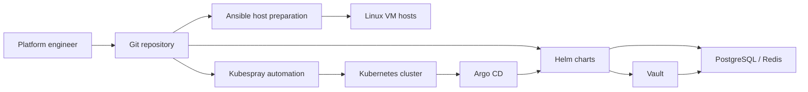

# Architecture

`heritage-infra` is organized as a reference platform engineering repository for a small Kubernetes environment. It separates host preparation, Kubernetes provisioning, and GitOps application delivery into reviewable repository areas.

## System Context

## Repository Areas

| Area | Responsibility | Operational boundary |
|---|---|---|
| `ansible_host_settings/` | Prepare Linux hosts for Kubernetes. | OS packages, container runtime, kernel/sysctl, firewall, base users. |
| `heritage-kubespray-automatic/` | Provision and operate Kubernetes through Kubespray. | Inventory, cluster variables, bootstrap scripts, upgrade flow, optional UI. |
| `heritage-k8s-helm-charts/` | Deliver platform services through Helm and Argo CD. | Vault, Vault Secrets Operator, PostgreSQL, Redis, GitLab Runner, external access manifests. |

## Deployment Flow

1. Prepare VM hosts with Ansible.
2. Bootstrap Kubespray dependencies and inventory.
3. Provision or upgrade the Kubernetes cluster.
4. Install platform addons such as storage and Argo CD.
5. Let Argo CD reconcile platform service charts.
6. Store application credentials in Vault and synchronize Kubernetes secrets through Vault Secrets Operator.

## GitOps Model

Argo CD is expected to reconcile the `heritage-k8s-helm-charts/argocd-applications` directory as an app-of-apps entry point.

The intended control flow is:

- Git is the reviewed source of desired state.
- Argo CD applies declarative application manifests.
- Helm charts describe service-level configuration.
- Secrets are not stored as plaintext application credentials in Git.
- Environment-specific values should be reviewed before being reused outside a lab environment.

## Production Readiness Notes

This repository is a public reference and lab baseline. Before adapting it to a production environment, review:

- node inventory and public endpoints;
- storage class assumptions;
- Vault mode and unseal strategy;
- ingress exposure and allowed source networks;
- backup and restore procedures;
- RBAC, service accounts, and admin credentials;
- Kubernetes upgrade policy;
- secret rotation and incident response steps.
