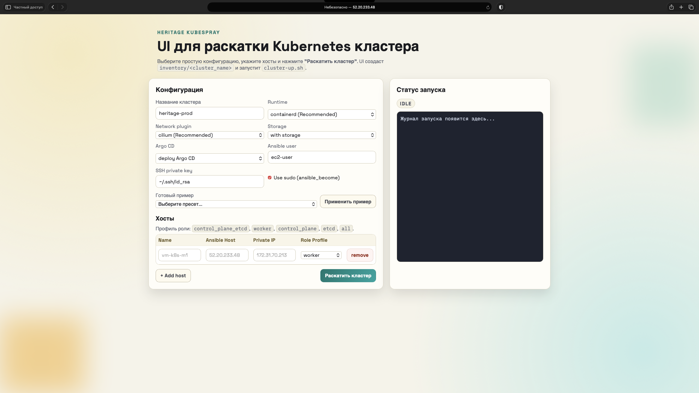

# heritage-kubespray-automatic

Этот репозиторий хранит:

- актуальный `inventory` и кластерные переменные;
- ссылку на фиксированную версию Kubespray: `v2.30.0` через git submodule.

## Структура

- `kubespray/` - submodule на `https://github.com/kubernetes-sigs/kubespray.git`
- `inventory/mycluster/` - inventory и `group_vars`
- `scripts/` - команды для bootstrap и запуска playbook
- `ui/` - web UI для генерации inventory и запуска раскатки

## Подготовка

```bash
git clone git@github.com:Zakharden/heritage-infra.git
cd heritage-kubespray-automatic
git submodule update --init --recursive
./scripts/bootstrap.sh
```

## Деплой кластера

```bash
./scripts/cluster-up.sh
```

Скрипт автоматически делает повторную попытку при временных сбоях API (`CLUSTER_UP_MAX_ATTEMPTS=2`, задержка `CLUSTER_UP_RETRY_DELAY_SECONDS=30`).
После успешной раскатки kubeconfig сохраняется в `~/.kube/<cluster>.conf` и по умолчанию обновляет `~/.kube/config`.

Для запуска конкретного inventory:

```bash
./scripts/cluster-up.sh --cluster mycluster
```

## Что включено из addons

- `local-path-provisioner` (`StorageClass: local-path`)
- `local-volume-provisioner` (`StorageClass: local-storage`)
- `Argo CD` (namespace `argocd`)

## Проверка после раскатки

```bash
kubectl get storageclass
kubectl -n argocd get pods
kubectl -n argocd get secret argocd-initial-admin-secret -o jsonpath='{.data.password}' | base64 -d && echo
```

`local-storage` работает из пути `/mnt/disks` на нодах. 

#todo Для production добавить реальные mount points/диски под `/mnt/disks/*`!

## Апгрейд кластера

```bash
./scripts/cluster-upgrade.sh
```

Для апгрейда конкретного inventory:

```bash
./scripts/cluster-upgrade.sh --cluster mycluster
```

## Web UI

```bash
./scripts/ui.sh
```

UI доступен на `http://<host>:8090` и позволяет:

- выбрать runtime: `containerd` или `docker`;
- выбрать сетевой плагин: `cilium` или `calico`;
- выбрать раскатку storage (`local-path` + `local-storage`) или без storage;
- выбрать раскатку Argo CD или без него;
- указать хосты;
- указать имя кластера.

После нажатия кнопки "Раскатить кластер" UI:

- создаёт/обновляет `inventory/<cluster_name>/inventory.ini`;
- пишет overrides в `inventory/<cluster_name>/group_vars/k8s_cluster/zz-heritage-ui.yml`;
- запускает `./scripts/cluster-up.sh --cluster <cluster_name>`.

### Скриншот UI



## Где менять переменные

- `inventory/mycluster/group_vars/all/all.yml`
- `inventory/mycluster/group_vars/k8s_cluster/k8s-cluster.yml`
- `inventory/mycluster/inventory.ini`

## Обновление версии Kubespray

```bash
cd kubespray
git fetch --tags
git checkout <new-tag>
cd ..
git add kubespray
git commit -m "Update Kubespray to <new-tag>"
```

## Подробная документация

- Полная инструкция по использованию всех функций:
  `docs/OPERATIONS_GUIDE_RU.md`
- Отдельная обучающая статья для новичка:
  `docs/LEARNING_CLUSTER_FROM_ZERO_RU.md`
